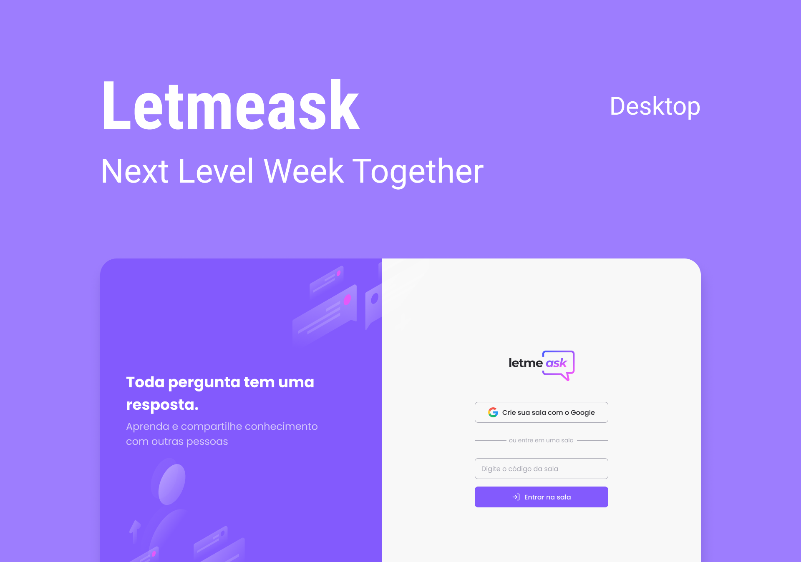

<h1 align="center">
    
</h1>

<br>

## 🧪 Technologies

Application development with the following technologies:

- [React](https://reactjs.org)
- [Firebase](https://firebase.google.com/)
- [TypeScript](https://www.typescriptlang.org/)

## 🚀 How to run

Clone the repository and access the created folder.

```bash
$ git clone https://github.com/gaabrielo/letmeask
$ cd letmeask
```

Now replicate the following steps to start the project:
```bash
# Install dependencies
$ yarn

# Start the project
$ yarn start
```
Now access localhost:3000 from your browser.

It's necessary to create an account in [Firebase](https://firebase.google.com/) and a project to make a Realtime Database available.

## 💻 Project

Letmeask is perfect for content creators to organize Q&A chats with their audience in a very organized and democratic way.
